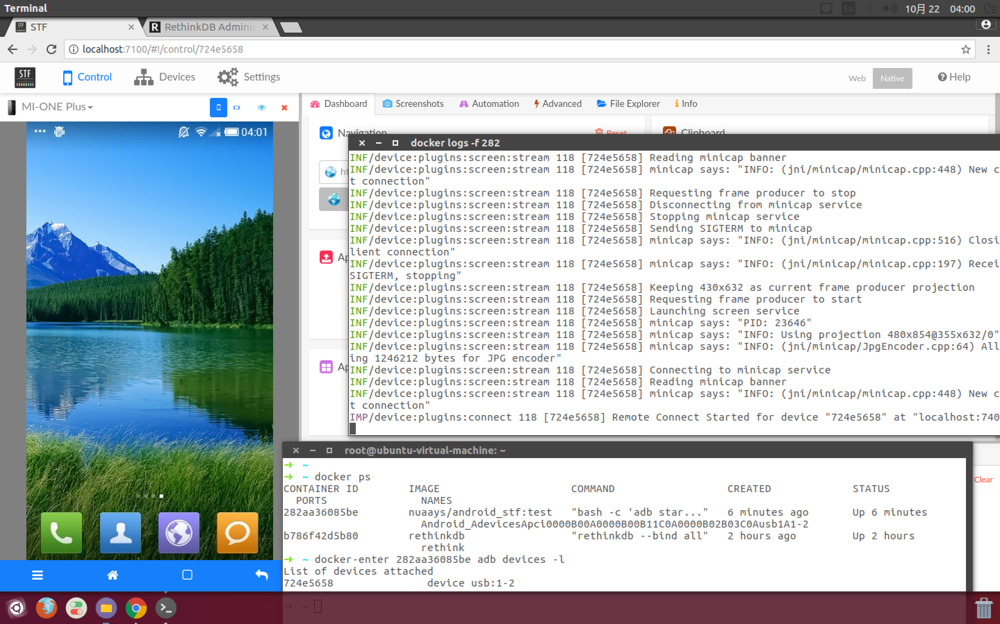

## One Android Devices mapping to One Docker Container using udev and cgroup



* host udev rule setup

```
cp ./bin/* /usr/bin
cp -f 99-detect.rules  /etc/udev/rules.d/
service udev restart
udevadm trigger
```

* android_udev_stf_container image build

```
docker build -t nuaays/android_stf .
```

* simple docker image only with adb

```
nuaays/android_stf:adb
```

* docker image with stf and rethinkdb

```
nuaays/android_stf:stf
```


## Monitor the change on USB by udevadm monitor command
- just get event 

```
udevadm monitor -u --subsystem-match=usb
monitor will print the received events for:
UDEV - the event which udev sends out after rule processing

UDEV  [7720.921717] remove   /devices/pci0000:00/0000:00:11.0/0000:02:03.0/usb1/1-2/1-2:1.1 (usb)
UDEV  [7720.929956] remove   /devices/pci0000:00/0000:00:11.0/0000:02:03.0/usb1/1-2/1-2:1.0 (usb)
UDEV  [7720.932053] remove   /devices/pci0000:00/0000:00:11.0/0000:02:03.0/usb1/1-2 (usb)
UDEV  [7724.501340] add      /devices/pci0000:00/0000:00:11.0/0000:02:03.0/usb1/1-2 (usb)
UDEV  [7724.505189] add      /devices/pci0000:00/0000:00:11.0/0000:02:03.0/usb1/1-2/1-2:1.0 (usb)
UDEV  [7724.510521] add      /devices/pci0000:00/0000:00:11.0/0000:02:03.0/usb1/1-2/1-2:1.1 (usb)
```
- get both event and enviroment

```
udevadm monitor -u --subsystem-match=usb --environment  
```

the result are as follows:
```
monitor will print the received events for:
UDEV - the event which udev sends out after rule processing

UDEV  [9202.807021] remove   /devices/pci0000:00/0000:00:11.0/0000:02:03.0/usb1/1-2/1-2:1.1 (usb)
ACTION=remove
DEVPATH=/devices/pci0000:00/0000:00:11.0/0000:02:03.0/usb1/1-2/1-2:1.1
DEVTYPE=usb_interface
ID_VENDOR_FROM_DATABASE=Google Inc.
INTERFACE=255/66/1
MODALIAS=usb:v18D1p9025d0231dc00dsc00dp00icFFisc42ip01in01
PRODUCT=18d1/9025/231
SEQNUM=8566
SUBSYSTEM=usb
TYPE=0/0/0
USEC_INITIALIZED=8475333643

UDEV  [9202.827430] remove   /devices/pci0000:00/0000:00:11.0/0000:02:03.0/usb1/1-2/1-2:1.0 (usb)
ACTION=remove
DEVPATH=/devices/pci0000:00/0000:00:11.0/0000:02:03.0/usb1/1-2/1-2:1.0
DEVTYPE=usb_interface
ID_VENDOR_FROM_DATABASE=Google Inc.
INTERFACE=8/6/80
MODALIAS=usb:v18D1p9025d0231dc00dsc00dp00ic08isc06ip50in00
PRODUCT=18d1/9025/231
SEQNUM=8565
SUBSYSTEM=usb
TYPE=0/0/0
USEC_INITIALIZED=8475332701

UDEV  [9202.828414] remove   /devices/pci0000:00/0000:00:11.0/0000:02:03.0/usb1/1-2 (usb)
ACTION=remove
BUSNUM=001
DEVNAME=/dev/bus/usb/001/011
DEVNUM=011
DEVPATH=/devices/pci0000:00/0000:00:11.0/0000:02:03.0/usb1/1-2
DEVTYPE=usb_device
ID_BUS=usb
ID_MODEL=Android
ID_MODEL_ENC=Android
ID_MODEL_ID=9025
ID_REVISION=0231
ID_SERIAL=Android_Android_724e5658
ID_SERIAL_SHORT=724e5658
ID_USB_INTERFACES=:080650:ff4201:
ID_VENDOR=Android
ID_VENDOR_ENC=Android
ID_VENDOR_FROM_DATABASE=Google Inc.
ID_VENDOR_ID=18d1
MAJOR=189
MINOR=10
PRODUCT=18d1/9025/231
SEQNUM=8567
SUBSYSTEM=usb
TYPE=0/0/0
USEC_INITIALIZED=8475321439

UDEV  [9212.816382] add      /devices/pci0000:00/0000:00:11.0/0000:02:03.0/usb1/1-2 (usb)
ACTION=add
BUSNUM=001
DEVNAME=/dev/bus/usb/001/012
DEVNUM=012
DEVPATH=/devices/pci0000:00/0000:00:11.0/0000:02:03.0/usb1/1-2
DEVTYPE=usb_device
DRIVER=usb
ID_BUS=usb
ID_MODEL=Android
ID_MODEL_ENC=Android
ID_MODEL_ID=9025
ID_REVISION=0231
ID_SERIAL=Android_Android_724e5658
ID_SERIAL_SHORT=724e5658
ID_USB_INTERFACES=:080650:ff4201:
ID_VENDOR=Android
ID_VENDOR_ENC=Android
ID_VENDOR_FROM_DATABASE=Google Inc.
ID_VENDOR_ID=18d1
MAJOR=189
MINOR=11
PRODUCT=18d1/9025/231
SEQNUM=8568
SUBSYSTEM=usb
TYPE=0/0/0
USEC_INITIALIZED=9212815498

UDEV  [9212.833764] add      /devices/pci0000:00/0000:00:11.0/0000:02:03.0/usb1/1-2/1-2:1.0 (usb)
.MM_USBIFNUM=00
ACTION=add
DEVPATH=/devices/pci0000:00/0000:00:11.0/0000:02:03.0/usb1/1-2/1-2:1.0
DEVTYPE=usb_interface
DRIVER=usb-storage
ID_VENDOR_FROM_DATABASE=Google Inc.
INTERFACE=8/6/80
MODALIAS=usb:v18D1p9025d0231dc00dsc00dp00ic08isc06ip50in00
PRODUCT=18d1/9025/231
SEQNUM=8569
SUBSYSTEM=usb
TYPE=0/0/0
USEC_INITIALIZED=9212823278

UDEV  [9212.852586] add      /devices/pci0000:00/0000:00:11.0/0000:02:03.0/usb1/1-2/1-2:1.1 (usb)
.MM_USBIFNUM=01
ACTION=add
DEVPATH=/devices/pci0000:00/0000:00:11.0/0000:02:03.0/usb1/1-2/1-2:1.1
DEVTYPE=usb_interface
ID_VENDOR_FROM_DATABASE=Google Inc.
INTERFACE=255/66/1
MODALIAS=usb:v18D1p9025d0231dc00dsc00dp00icFFisc42ip01in01
PRODUCT=18d1/9025/231
SEQNUM=8572
SUBSYSTEM=usb
TYPE=0/0/0
USEC_INITIALIZED=9212838805
```
